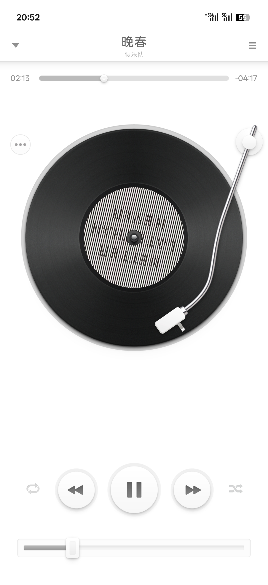
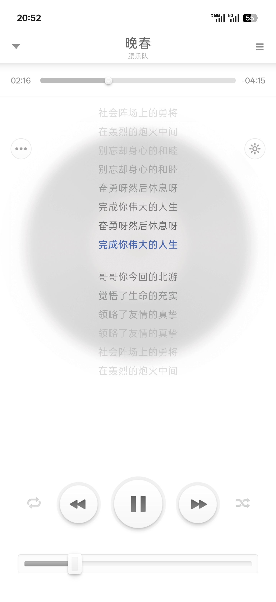
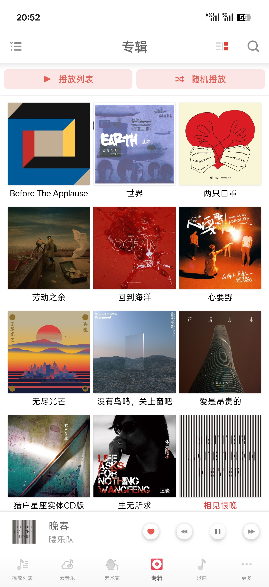
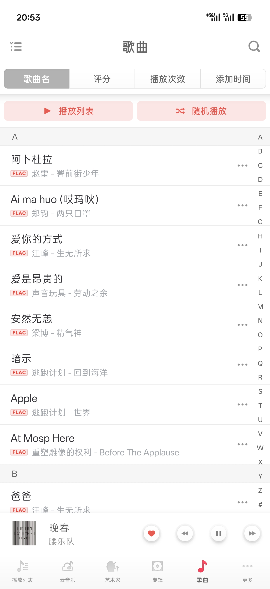
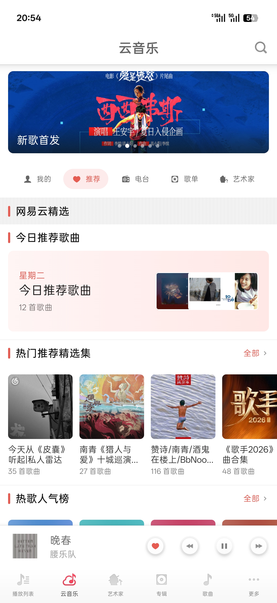
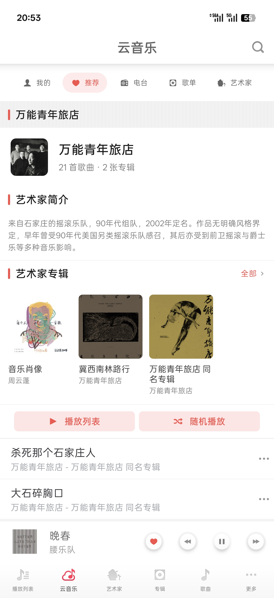
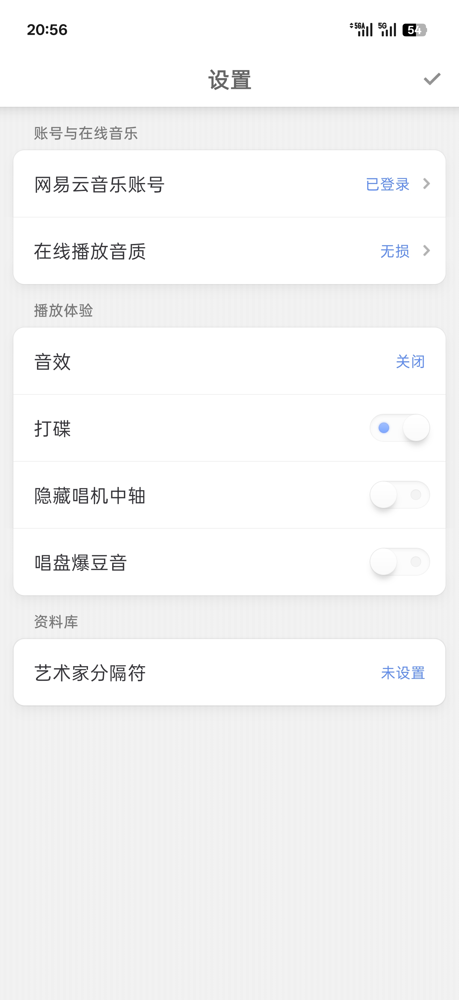
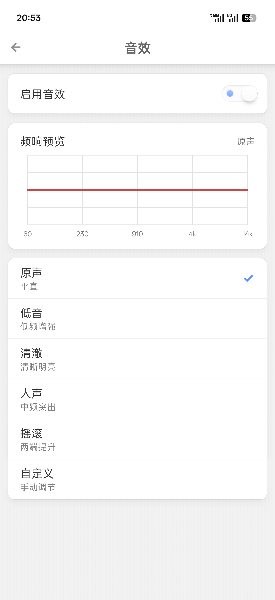

# 锤子音乐复刻 (Smartisan Music Revived)

[English](./README_EN.md) | 中文

[](https://github.com/wowohut/SmartisanMusic-Revived/releases)
[](https://kotlinlang.org)
[](https://developer.android.com/build)
[](https://developer.android.com/about/versions/12)
[](./LICENSE)

> “这是为你们做的。”

Smartisan Music 是 Smartisan OS 里我一直很喜欢的系统应用。

Smartisan OS 早已退出历史舞台，原版音乐播放器也留在了旧 Android 里。但那套黑胶唱盘、唱针拖拽、搓碟、光影和小动画，放到现在还是很难被别的播放器替代。所以我想把它带回现代 Android 上继续欣赏使用，同时补上在线音乐、播放音效、歌词显示等现代播放器该有的能力。

> [!NOTE]
> 本项目不提供公共云端曲库或媒体分发服务。云音乐能力依赖用户自己的网易云音乐账号授权，会员或受限内容仍需遵循网易云音乐平台规则。

## 项目进展

当前版本已经相对完善和稳定。主界面和播放页经过了很多轮逆向、对照和真机调整，整体观感、页面层级、动画/动效和主要交互都达到了我满意的状态。

### 本地播放

- 本地音乐扫描、后台播放、收藏、播放列表、播放统计
- 外部音频打开、简易音效、自定义艺术家分隔符
- 歌曲排序筛选、多选滑动、字母快捷栏

### 云音乐（3.0 新增）

- 网易云音乐账号登录、首页推荐、搜索
- 歌单、专辑、艺术家、电台 / 播客浏览
- 喜欢列表、每日推荐、账号歌单浏览
- 歌单创建、添加歌曲、移除歌曲、删除歌单
- 在线播放 URL 刷新、在线队列恢复、在线封面和在线歌词
- 页面 / 歌词 / 流媒体缓存

### 视觉与交互

- 底部播放条、搜索、弹窗
- 黑胶唱盘、唱针拖拽、搓碟
- 歌词 / 控制区、播放队列展开和队列拖拽排序

后面如果继续改，主要就是维护稳定性、继续优化细节和性能，以及修复我还没发现的 Bug。

## 真机截图

<p align="center">
  
  
  
  
</p>
<p align="center">
  
  
  
  
</p>

> 截图中展示的专辑封面、艺人图片、品牌标识及音乐内容版权归原作者所有，仅用于展示本应用界面效果。

## 项目背景

这个项目一开始是一个纯 Jetpack Compose 版本，当时以 Smartisan OS 6.8.0（坚果 R1）作为复刻基准。这段历史现在保存在 `archive/6.8.0-compose` 分支里。

那一版基本可用，播放链路与主要功能都已跑通。但如果目标是真正 1:1 复刻 Smartisan Music，它始终差一点：锤子音乐很多细节不是“把元素画在同样的位置”就完了，它依赖旧 View/XML 体系里的测量、阴影、selector、列表分层、文本排版、按压状态和动画节奏。

Compose 版在细节还原上仍有明显差距。

所以才有了现在的 8.1.0 legacy View 版本。

现在这版用 legacy View 壳保住视觉事实：能按原版 XML、drawable、dimens、selector、anim 和控件结构做的，就尽量按原版做。播放、扫描、收藏、队列、设置和后台服务则重新用现代 Android 技术栈实现。

需要说明的是，8.1.0 原版并没有云音乐、歌词显示、播放音效、艺术家分隔符这些功能，都是我们在复刻过程中补上的现代播放器能力。

## 技术栈

| 类别 | 技术                                                 |
| ---- | ---------------------------------------------------- |
| 构建 | Android Gradle Plugin `9.2.1`                      |
| 语言 | Kotlin `2.4.0`                                     |
| UI   | legacy View 壳 + Jetpack Compose 桥接                |
| 播放 | Media3 `1.10.1`                                    |
| 存储 | Room `2.8.4` + DataStore Preferences `1.2.1`     |
| 在线 | 网易云音乐账号能力 + 页面 / 歌词 / 流媒体缓存          |
| 图片 | Coil `3.5.0`                                      |
| SDK  | `minSdk 31` / `targetSdk 36` / `compileSdk 37` |

## 项目结构

```text
.
├── app/
│   └── src/main/
│       ├── java/com/smartisanos/music/
│       │   ├── SmartisanMusicApplication.kt  # 应用入口
│       │   ├── MainActivity.kt               # legacy View 主壳入口
│       │   ├── data/                         # Room、DataStore、Repository
│       │   │   └── online/                   # 网易云音乐数据层、账号状态、缓存和接口解析
│       │   ├── playback/                     # Media3 播放服务、本地媒体库、队列、封面和歌词
│       │   │   └── PlaybackService.kt        # 后台播放服务
│       │   └── ui/
│       │       ├── shell/                    # 8.1.0 legacy 主壳、页面、转场和弹窗
│       │       │   └── cloud/                # 云音乐页面、路由、列表和详情页
│       │       ├── online/                   # 网易云账号登录等在线能力 UI
│       │       ├── playback/                 # 播放页、唱盘、搓碟、弹层和控制区
│       │       └── widgets/                  # 为复刻补的旧 View / shim 控件
│       └── res/                              # 8.1.0 迁移资源和现代 Android 资源
├── docs/
├── reverse/
└── gradle/
```

更多 legacy shell 设计说明见 [docs/legacy-shell-structure.md](./docs/legacy-shell-structure.md)。

## 下载与反馈

从 [GitHub Releases](https://github.com/wowohut/SmartisanMusic-Revived/releases) 下载最新 APK。

遇到问题或有建议，欢迎在 [Issues](https://github.com/wowohut/SmartisanMusic-Revived/issues) 讨论。

## 致谢

感谢 [People-11](https://github.com/People-11/) 的 [SmartisanOS_APP_Port](https://github.com/People-11/SmartisanOS_APP_Port/) 移植工作。该项目里的 `Music_8.1.0.apk` 补全了原版音乐 APK 与 Smartisan OS 系统框架之间的耦合缺口，让 8.1.0 版本能在非 Smartisan 设备上运行，也成为本仓库复刻的视觉与交互基准。

People-11 做的是 Smartisan OS APP 移植，尽量让原版 APK 本身在其他系统上原汁原味地继续运行；本仓库则是锤子音乐复刻，UI 尽量贴近 8.1.0 原版，但播放链路、媒体扫描、队列、收藏、设置、数据持久化和后台服务都是重新用现代 Android 技术栈写的，因此可以在不破坏原版味道的前提下继续维护和扩展新功能。

## 免责声明

本项目与字节跳动无关，仅为个人兴趣驱动的非官方复刻。

- Smartisan OS 及相关视觉设计的知识产权归原权利人所有。
- 8.1.0 APK 资源文件仅供学习研究，版权归原权利人所有。
- 云音乐能力依赖用户自己的网易云音乐账号授权，本项目不提供公共曲库、媒体分发服务或第三方平台会员权益。
- 原创代码仅限非商业用途。
- 本项目按「原样」（AS IS）提供，作者不对因使用本项目而产生的任何直接或间接损失承担责任，包括但不限于账号受限、数据丢失、版权纠纷或服务中断。

## 许可证

本项目原创代码采用自定义非商业许可证（Custom NonCommercial License）。详见 [LICENSE](./LICENSE)。

---

复刻它不只是怀旧，是希望打开它的那一刻，你也能感到和我一样的愉悦。
